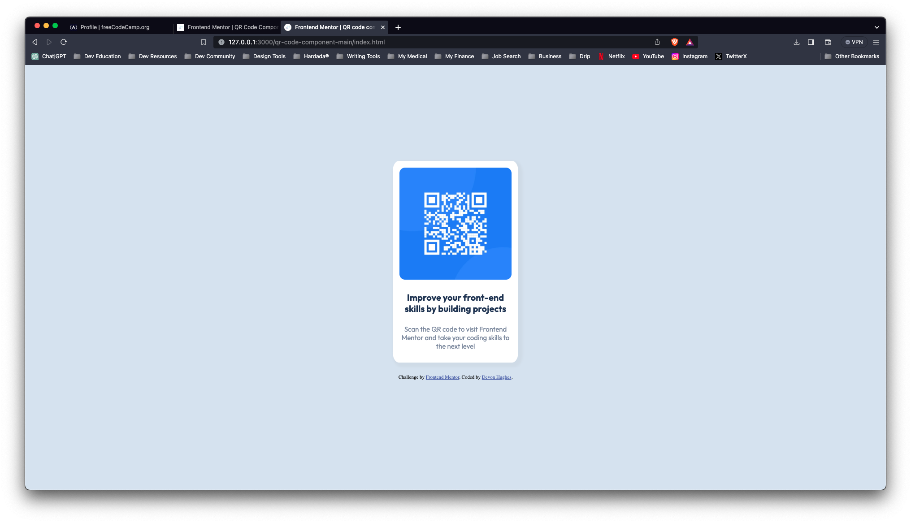
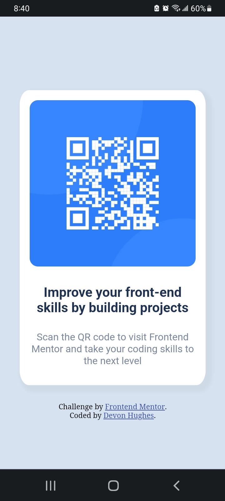

# Frontend Mentor - QR code component solution

This is a solution to the [QR code component challenge on Frontend Mentor](https://www.frontendmentor.io/challenges/qr-code-component-iux_sIO_H). Frontend Mentor challenges help you improve your coding skills by building realistic projects. 

## Table of contents

  - [Screenshot](#screenshot)
  - [Links](#links)
  - [Built with](#built-with)
  - [What I learned](#what-i-learned)
  - [Continued development](#continued-development)
- [Author](#author)
- [Acknowledgments](#acknowledgments)

### Screenshots

### Links

- Solution URL: [Solution on GitHub](https://github.com/DevonHughesCodes/QR-Component-Solution)
- Live Site URL: [Add live site URL here](https://your-live-site-url.com)

### Built with

- Semantic HTML5 markup
- CSS custom properties
- Flexbox
- CSS Grid
- Visual Studio Code

### What I learned

While working on this project, I learned and applied several key concepts in web development, including:

HTML Structure: I gained experience in creating a well-structured HTML document, including using semantic tags for content sections, setting up the viewport, and including essential metadata.

CSS Styling: I practiced CSS styling techniques such as defining background colors, setting text and font styles, and creating responsive layouts. This involved setting margins and padding, using border-radius for rounded corners, bow shadows, and aligning content.

Image Handling: I worked with images in HTML, including setting image attributes like alt for accessibility and ensuring images scale appropriately with different screen sizes.

Flexbox and Centering: I used flexbox to center content both vertically and horizontally, creating a visually appealing and responsive design.

Media Queries: I implemented a media query for smaller screens, allowing the layout to adapt to different devices and screen sizes.

External Resources: I practiced linking external resources, such as fonts and images, in my HTML document.

Accessibility: I improved the accessibility of my project by adding descriptive alt text to images, enhancing the overall user experience.

In summary, this project allowed me to apply fundamental HTML and CSS skills to create a responsive and visually appealing web component. These skills are valuable for building more complex web applications and websites in the future.

### Continued development

HTML5, CSS, and Javascript.

## Author

- CodePen - [Devon Hughes](https://codepen.io/Devon-Hughes-the-decoder)
- Frontend Mentor - [@DevonHughesCodes](https://www.frontendmentor.io/profile/DevonHughesCodes)
- Twitter - [@HughesDevDesign](https://twitter.com/HughesDevDesign)

## Acknowledgments

I'd like to thank Alex Fernández *(Arekkusu17)* <-on GitHub. After reviewing his cascading style sheet and trying out different methods on my own, I was able to get my solution to a spot where I felt it matched the challenge example.
